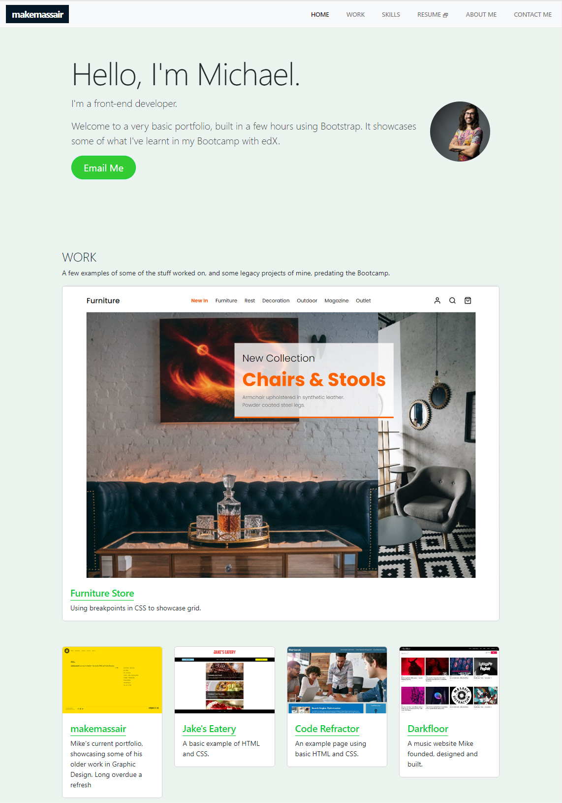

# Bootstrap-Portfolio

## Description

Module 3 challenge. Building a one page portfolio layout using the Bootstrap CSS Framework.

### User Story

To put into practice a culimination of the first three weeks of Bootcamp, but primarily using Bootstrap to quickly make a fully functioning and responsive portfolio webpage.

### Acceptance Criteria

* To create a repo called `Bootstrap-Portfolio`.

* To create a folder strucutre inside `Bootstrap-Portfolio` with a `CSS` folder, an `images` folder, and an `index.html` file.

* Use Bootstrap to create a portfolio website with the following items.

    - Navigation bar at the top, which includes links to the appropriate sections of my portfolio.

    - A hero section - including my name, photo, and any additional information I'd like to share.

    - A work section - displaying linked working examples of my work with images, titles and a brief description of the project.

    - A skills section - laying out the skills I expect to learn from the Bootcamp.

    - About and contact me sections in the same row.

    - A footer - hyperlinks should have a hover effect.

    - All buttons should display a box shadow on hover.

* My Bootstrap solution should minimise the use of media queries
* Deployment to my Github.

### Deployed Application

View the deployed application for week-3: responsive-portfolio-lesson at [makemassair.github.io](https://makemassair.github.io/).

### Screenshot

